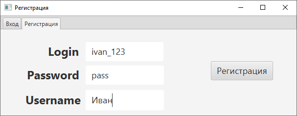
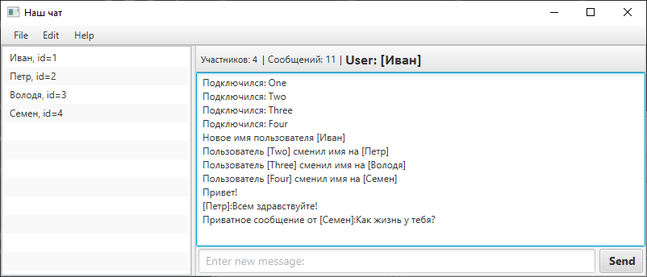
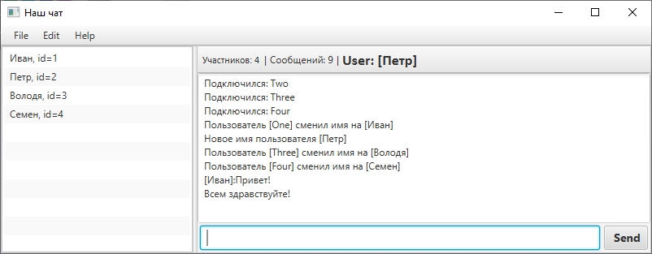
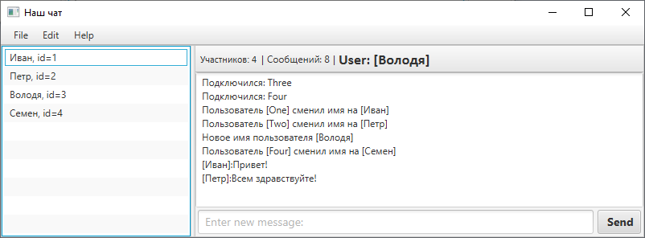
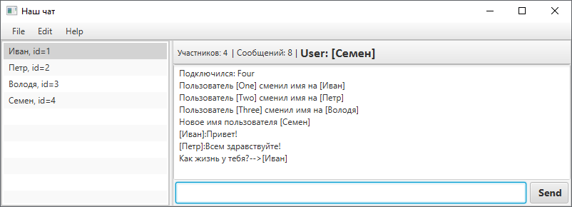

# Сетевой чат (клиентская часть)
Учебный проект GeekBrains (клиент и [сервер](https://github.com/igojig/ServerConsole))


<p align="center">
    
    
</p>

<p align="center">
    &nbsp;
    &nbsp;
    &nbsp;
    &nbsp;
</p> 

## Функционал проекта:

- загрузка с сервера истории сообщений при входе пользователя 
- отображение списка активных пользователей
- подсчет сообщений
- [контекстное меню](./github_samples/context_menu.png)
- отправка приватных сообщений конкретному пользователю
- очистка истории сообщений
- смена имени пользователя
- сохранение истории сообщений на сервере при выходе
- [регистрация нового пользователя](./github_samples/register_sample.png)
- [закрытие клиента при процедуре входа или регистрации при неактивности клиента в течении 60 сек. (время устанавливается на сервере)](./github_samples/exit_client.png)
- вывод лога в консоль
## Установка
````
git clone https://github.com/igojig/FxMessager_client
````

## Запуск
Для функционирования требуется запуск [серверной части](https://github.com/igojig/ServerConsole)
```
chcp 1251
mvn clean javafx:run
```

Или запускать из IDE.<br> Для запуска нескольких экземпляров приложения установить параметр:<br>
[Edit configuration->Modify options->Allow multiple instances](github_samples/edit_configuration.png)


## Создание исполняемого образа
```
mvn clean javafx:jlink
```

#### Параметры для входа
при старте серверной части создаются четыре пользователя:
```
[login]  [password]  [username]
   1         1          One
   2         2          Two
   3         3          Three
   4         4          Four
```
также есть возможность зарегистрировать нового пользователя


