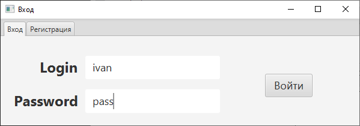
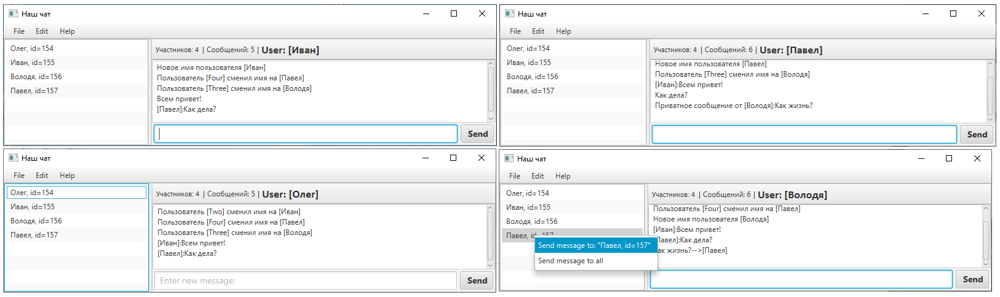

## Сетевой чат

### Клиентская часть сетевого чата

    

Для запуска требуется запуск серверной части:  

### Функционал проекта:

- загрузка с сервера истории сообщений при входе пользователя 
- отображение списка активных пользователей
- подсчет сообщений
- [контекстное меню](./github_samples/context_menu.png)
- отправка приватных сообщений конкретному пользователю
- очистка истории сообщений
- смена имени пользователя
- сохранение истории сообщений на сервере при выходе
- [регистрация нового пользователя](./github_samples/register_sample.png)
- [закрытие клиента при процедуре входа или регистрации при неактивности клиента в течении 60 сек. (время устанавливается на сервере)](./github_samples/exit_client.png)
